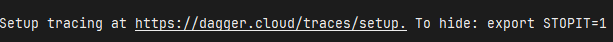

# Getting started with Dagger

L'objectif est de construire les composants d'un pipeline de CI pour une application web nommée `hello` (permettant de faire un `hello "<ce que l'on veut>"`) sous la forme d'un module Dagger.

## Initialisation du module Dagger

> [!NOTE]
> Si vous utilisez une installation locale de Dagger, clonez le fork du repository du codelab sur votre machine :
> ```bash
> git clone https://github.com/<votre-pseudo-github>/Enter-the-Daggerverse.git
> ```

Ensuite, ouvrez le répertoire de l'application `hello` :
```bash
cd hello
```

> [!IMPORTANT]
> Toutes les commandes suivantes seront exécutées dans le répertoire `hello` depuis votre terminal.

Initialisez votre module de Dagger :
```bash
dagger init --sdk=go --source=./dagger
```

Cette commande va télécharger l'image docker du Dagger engine, le démarrer et générer votre structre de module Dagger :
- Un fichier `dagger.json` de metadata,
- Un répertoire `dagger` : 
  - Un fichier `main.go` qui va contenir le code de votre module,
  - Un ficher `dagger.gen.go` et un répertoire `internal` contenant le code utilitaire généré par Dagger,

Dans le fichier `dagger/main.go`, remplacez le code existant par celui ci-dessous :

```go
package main

import (
	"context"
	"dagger/hello/internal/dagger"
	"fmt"
	"math"
	"math/rand/v2"
)

type Hello struct {
}

// Publish the application container after building and testing it on-the-fly
func (m *Hello) Publish(ctx context.Context, source *dagger.Directory) (string, error) {
	return m.Build(source).
		Publish(ctx, fmt.Sprintf("ttl.sh/hello-%.0f", math.Floor(rand.Float64()*10000000))) //#nosec
}

// Build the application container
func (m *Hello) Build(source *dagger.Directory) *dagger.Container {
	build := m.BuildEnv(source).
		WithExec([]string{"go", "build", "-o", "bin/"}).
		Directory("./bin")
	return dag.Container().From("debian:bookworm-slim").
		WithDirectory("/usr/bin/", build).
		WithExposedPort(666).
		WithEntrypoint([]string{"/usr/bin/hello"})
}

// Build a ready-to-use development environment
func (m *Hello) BuildEnv(source *dagger.Directory) *dagger.Container {
return dag.Container().
	From("golang:1.23-alpine").
	WithDirectory("/src", source).
	WithWorkdir("/src").
	WithEnvVariable("CGO_ENABLED", "0")
}
```

> [!NOTE]
> Le module se compose dorénavant de 3 fonctions :
> - `BuildEnv` pour construire un environnement (une image Docker) pour être utilisé par les autres fonctions,
> - `Build` pour compiler l'application web,
> - `Publish` pour publier votre application sur la registry `ttl.sh`.

> [!NOTE]
> `ttl.sh` est une registry publique pour Docker afin d'y stocker des images non-critiques de façon temporaire.

> [!WARNING]
> Le fichier `dagger.gen.go` souffre d'un problème de compilation.
> 
> En changeant le contenu du fichier, l'interface a évolué.
> 
> Il faut regénérer le code Dagger du module, avec la commande ci-dessous :
> ```bash
> dagger develop
> ```

## Construire l'environnement pour le pipeline de CI de l'application

> [!NOTE]
> Pour les méthodes publiques, le langage **Go** utilise la convention `PascalCase`. C'est à dire, Que chaque mot commence par une majuscule, le tout concaténé. Dans notre exemple, nous avant la méthode publique `BuildEnv`.
>
> Toutefois, pour appeler la méthode publique `BuildEnv` depuis la ligne de commande Dagger, le nom va utiliser la convention `kebab-case`. Ainsi, la méthode publique `BuildEnv` devra être appelée avec le nom `build-env`.
>
> Exemple ci-après.

Maintenant que nous avons un module, nous allons lancer une de ses fonctions :
```bash
dagger call build-env --source=.
```

Vous allez voir apparaître sur le terminal des traces **interactives**.
Essayez de les manipuler.
Exemple, pour augmenter la verbosité des traces pendant l'exécution, vous pouvez appuyer sur la touche `+`.

> [!NOTE]
> Toutes les traces & spans que vous voyez s'afficher sont de l'OpenTelemetry, comme pour une requête HTTP.
> Cela peut être perturbant au debut et très lié à Docker. 
> Avec le temps, on s'y fait bien.

A la fin de l'exécution de la commande, vous allez voir ce message :


En effet, par défaut, Dagger va essayer d'envoyer les traces dans le Dagger cloud. C'est un peu génant si on ne le souhaite pas. 

Il est possible de désactiver ce comportement en valorisant la variable d'environnement `STOPIT` (un nom assez curieux) et de relancer la commande :
```bash
export STOPIT=1
dagger call build-env --source=.
```

Le message a disparu.

> [!WARNING]
> Attention, il y a plusieurs possibilités de variables pour désactiver les traces : `GOAWAY`, `SHUTUP`, `STOPIT`, `NOTHANKS`, etc.

Vous avez maintenant un environnement d'exécution **Go** contenant les sources de votre projet à votre disposition.

## Dagger cloud

Afin d'exploiter plus facilement les traces, nous allons utiliser le **Dagger cloud**.

Pour réactiver l'envoi de traces, le plus simple est de supprimer la variable d'environnement :
```bash
unset STOPIT=1
```

Afin de pouvoir visualiser les traces, vous devez créer un compte sur le [Dagger cloud](https://docs.dagger.io/manuals/user/cloud-get-started).

> [!TIP]
> Afin de faciliter la suite du TP, si vous décidez de créer un compte **Dagger cloud**, le plus simple est d'utiliser votre compte GitHub (le bouton `Sign in with GitHub`).

Ensuite, créez l'organisation `devfest`.
Un token vous est proposé. Exporter le:

```bash
export DAGGER_CLOUD_TOKEN=<token>
```

Pour ne plus avoir à le faire à chaque ouverture de session/terminal, il faut ajouter ce token à votre contexte (`.profile` ou autre).

## Intéragir avec le résultat de votre fonction

Lorsque votre fonction retourne une image docker, vous avez la possibilité d'interagir avec cette dernière pour inspecter son contenu.

Lancer à nouveau la fonction `build-env` avec la commande `terminal` :
```bash
dagger call build-env --source=. terminal --cmd=sh
```

> [!WARNING]
> Bien choisir une image qui possède un shell (sh, bash, etc)

Vérifier que le répertoire du projet a bien été monté dans l'image :
```bash
ls -al
```

Tapez `exit` pour quitter le terminal lancé dans le container.

A la fin de l'exécution, un lien vers le **Dagger cloud** vous est affiché.
Cliquez dessus pour explorer les traces de votre commande.

## Compiler l'application

Maintenant que nous avons un environnement **Go**, nous allons pouvoir compiler l'application.

Lancer la commande:
```bash
dagger call build --source=.
```

L'application a été compilée et l'image docker construite !
La sortie/résultat de la fonction est une image docker prête à l'emploi !

Relancez la compilation pour intéragir avec l'image :
```bash
dagger call build --source=. terminal --cmd=sh
```

> [!NOTE]
> Mais d'où vient la comment `terminal` introuvable lorsqu'on lance la commande `dagger --help` ?
>
> Et bien on le trouve au détour de la documentation dans le [User Manual](https://docs.dagger.io/manuals/user/terminal)

Vérifiez que le binaire de l'application est bien présent :
```bash
ls -al /bin/hello
```

Tapez `exit` pour quitter le terminal lancé dans le container.

## Tester l'application

Maintenant que nous avons construit l'image docker de l'application, testons la sur notre poste !

Démarrez l'application avec la command `as-service` de Dagger :
```bash
dagger call build --source=. as-service up --ports=8080:666
```

Cliquez sur le bouton proposé par VSCode et ajouter `/devfest` à la fin de l'url de la page.

> [!NOTE]
> Si vous n'utilisez pas le codespace, ouvrez votre navigateur et entrez l'URL suivante `localhost:8080/devfest`.

> [!NOTE]
> Mais d'où vient la comment `as-service` introuvable lorsqu'on lance la commande `dagger --help` ?
>
> Et bien on le trouve au détour de la documentation dans le [User Manual](https://docs.dagger.io/manuals/user/services)

## Publier l'application

La dernière étape est de publier l'application sur le Daggerverse :
```bash
dagger call publish --source=.
```

Testez le conteneur publié (ID est l'identifiant unique du conteneur) :
```bash
docker run --rm --detach --publish 8080:666 ttl.sh/hello-<ID>
```

Dans l'onglet `PORTS` (à côté de celui de `TERMINAL`), ajoutez le port `8080`.

Cliquez sur le lien associé et ajoutez `/devfest` à la fin de l'url de la page.

> [!NOTE]
> Si vous n'utilisez pas le codespace, ouvrez votre navigateur et entrez l'URL suivante `localhost:8080/devfest`.

Vous avez maintenant un ensemble de fonctions utilisables pour cronstruire un pipeline de CI pour votre application, avec n'importe quel outil de CI/CD.

Pour la suite, vous allez utiliser un module externe dans les fonctions. Rendez-vous au chapitre [Utiliser un module du Daggerverse](03-utiliser-module-daggerverse.md).
