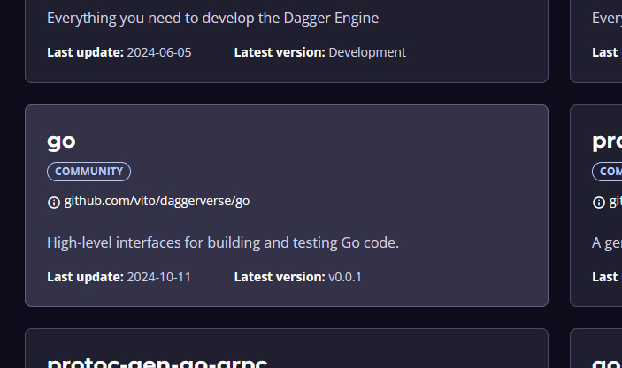

# Utiliser un module du Daggerverse

## Découverte du Daggerverse

Allez sur la page de [Daggerverse](https://daggerverse.dev)

Cette page contient l'ensemble des modules Dagger mis à disposition par la communauté.

Afin d'améliorer notre pipeline, nous allons chercher un module **Go** avec des fonctions utilitaires.

Cherchez un module avec le mot clé [go](https://daggerverse.dev/search?q=go) contenant fonctions utilitaires de type `build`, `test`, `generate`, etc.

> [!NOTE]
> Il y a de très nombreux résultats :
> - Certains correspondent à d'anciennes versions du même module qui a changé de répertoire dans son repository source voir de repository,
> - Certains ne sont plus maintenus,
> 
> Il n'existe aucun moyen de connaitre la fiabilité du développeur à l'origine du module (comme c'est le cas pour [npmjs](https://www.npmjs.com)).

Pour la suite, nous allons utiliser le module qui correspond à nos besoins :



Voici le lien direct : https://daggerverse.dev/mod/github.com/vito/daggerverse/go@f7223d2d82fb91622cbb7954177388d995a98d59

## Installation du module Go

Lancez la commande :
```bash
dagger install github.com/vito/daggerverse/go@v0.0.1
```

> [!NOTE]
> Il est aussi possible d'utiliser des modules non disponibles dans le Daggerverse. Plus d'informations dans cette la documentation officielke [Using Modules from Remote Repositories](https://docs.dagger.io/api/remote-modules).

Pour découvrir le module, afficher son aide :
```bash
dagger -m go call --help
```

Pour n'avoir que la liste des fonctions, utiliser :
```bash
dagger -m go functions
```

Une autre solution est de regarder directement le code source : https://github.com/vito/daggerverse/blob/main/go/main.go

> [!NOTE]
> Ici on utilise un module Go programmé en Go. Le module aurait pu être écrit dans un autre language (Typescript ou Python).
>
> Il n'est pas nécéssaire que la CI soit dans le même langage que le code source de l'application à construire.

## Utiliser le module Go dans le pipeline de l'application

### Modifier la fonction BuildEnv

Ajoutez un champ `builder` de type `Go` dans la structure `Hello` :
```go
type Hello struct {
	builder *dagger.Go
}
```

Il va nous permettre de manipuler une instance de la structure exposée par le module Go.

Remplacez la fonction `BuildEnv` par le code suivant dans le ficher `dagger/main.go` :
```go
// Build a ready-to-use development environment
func (m *Hello) BuildEnv() {
	m.builder = dag.Go().FromVersion("1.23-alpine")
}
```

Dorénavant, cette fonction ne retourne plus un container mais modifie l'instance `builder` de la structure `Hello` avec la version désirée de l'image docker golang.

> [!WARNING]
> Le fichier `dagger.gen.go` a un problème de compilation.
>
> En modifiant la fonction `BuildEnv`, l'interface du module Dagger a changé (suppression de la variable source de cette fonction).
> 
> Il faut regénérer le code Dagger du module :
> ```bash
> dagger develop
> ```

### Modifier la fonction Build

Remplacez la fonction `Build` par le code suivant dans le ficher `dagger/main.go` :
```go
// Build the application container
func (m *Hello) Build(source *dagger.Directory) *dagger.Container {
	m.BuildEnv()
	build := m.builder.Build(source, dagger.GoBuildOpts{Static: true})
	return dag.Container().From("debian:bookworm-slim").
		WithDirectory("/usr/bin/", build).
		WithExposedPort(666).
		WithEntrypoint([]string{"/usr/bin/hello"})
}
```

Dorénavant, cette fonction fait appel à `BuildEnv` pour sélectionner son contexte de build.

Puis la fonction `Build` du module Go importé précédemment (le module qui a été choisi dans le Daggerverse) pour réaliser la construction de l'application. 

L'option `Static: true` est l'équivalant de `WithEnvVariable("CGO_ENABLED", "0")` dans la version précédent de la fonction `BuildEnv`.

> [!NOTE]
> Dans Dagger, les arguments d'une fonction peuvent être [optionnels](https://docs.dagger.io/manuals/developer/functions/#optional-arguments) en l'indiquant par un commentaire dans le code de la fonction.
> 
> Il est aussi possible de donner une valeur par défaut.

> [!NOTE]
> Une convention (non documentée) pour les argument optionnels, est de mettre l'argument dans une strucutre.
> Cette structure est celle du module (ici `dagger.Go`).
>
> Elle est du format `dagger.<Package><Fonction>Opts`.
>
> Ici `dagger.GoBuildOpts` pour utiliser le paramètre `Static`.
> On lit donc l'argument nommé `Static` est une option `Opts` de la fonction `Build` du module Dagger `Go`.

### Tester les fonctions utilisant le module Go

Lancez la fonction `BuildEnv` (il n'y a plus besoin de l'argument `source`) :
```bash
dagger call build-env
```

Lancez la fonction `Build` :
```bash
dagger call build --source=.
```

Prenez le temps d'analyser les différences avant/après modifications dans les traces sur le Dagger cloud.

Pour la suite, vous allez [utiliser le module dans une GitHub Actions](04-utiliser-module-github-actions.md).
